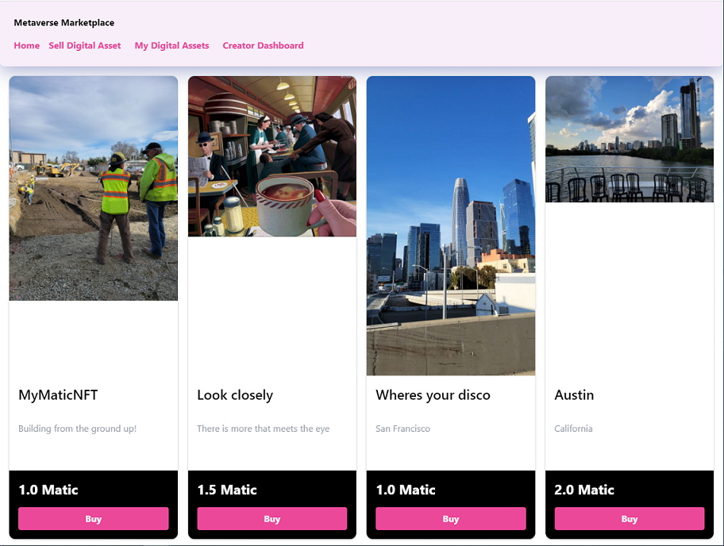
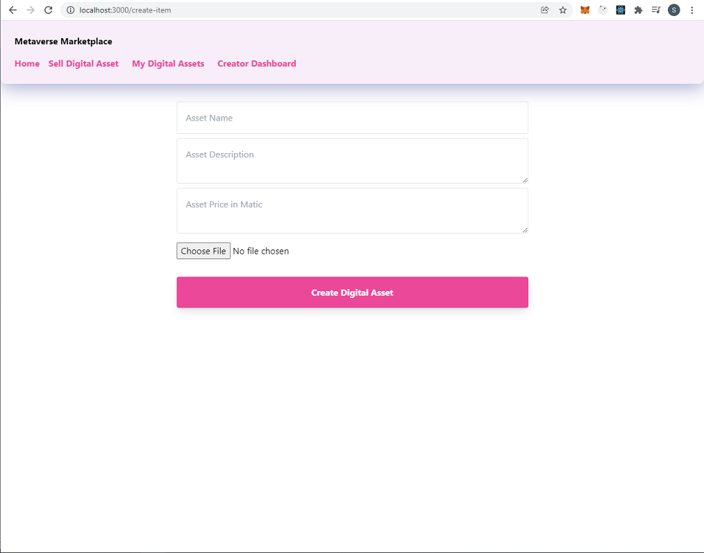
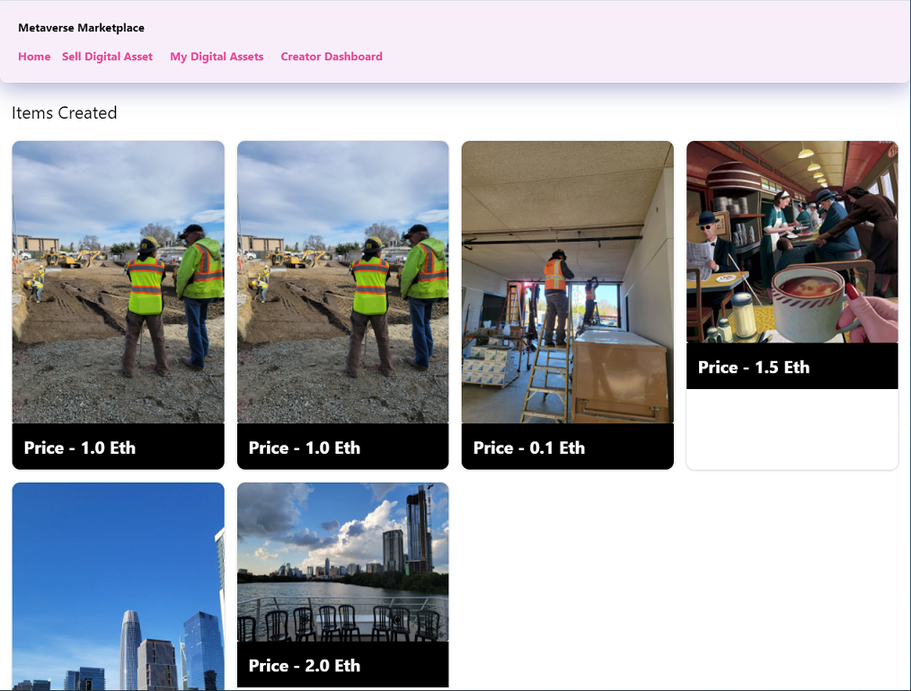
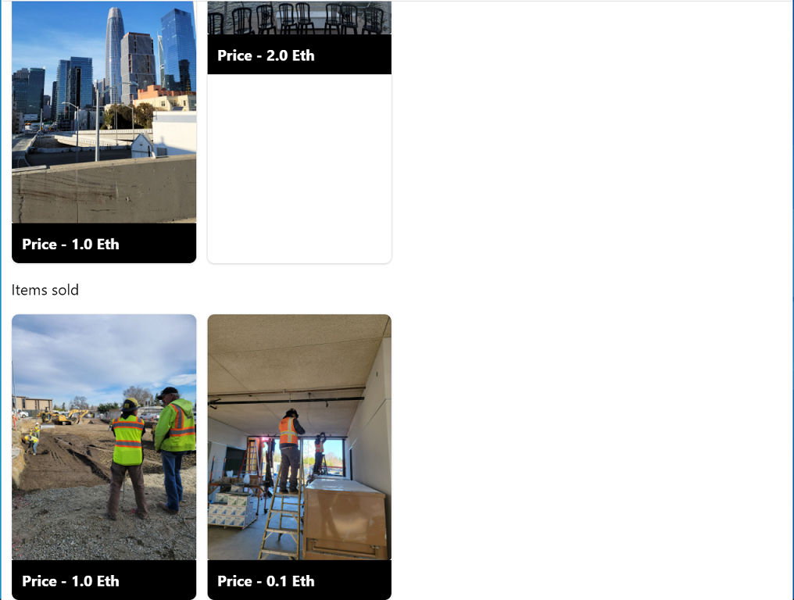

# Metaverse Marketplace

For full functionality (selling/viewing your assets, as well as creator dashboard) please download metamask at the following link. https://metamask.io/download/

You can receive free tokens to use by going to the following link https://faucet.polygon.technology/
Simply select Mumbai as your network, select Matic Token, and enter in your desired wallet address to send the tokens to.

This project is created using a NextJS framework to bring to life the Metaverse Marketplace. 
The Metaverse Marketplace allows the user to view NFTs for sale on the market place, set pricing and sell their own NFTs, view NFTs they have purchased, as well as a dashboard that shows items created/sold.

When listing an item for sale please list the asset name, description, and the price in Matic and then choose a jpeg to upload.
After a moment you should receive a prompt from your metamask extension or wallet asking for authorization of the transaction cost to list your NFT on the marketplace.
```
The app utilizes Next, Metamask, polygon mumbai test network, Axios, Ethers, and IPFS HTTP RPC API (https://github.com/ipfs/js-ipfs/tree/master/packages/ipfs-http-client#readme). For smart contract testing Hardhat (https://github.com/nomiclabs/hardhat) was utilized.

Check it out at the following link: 

Home



Sell Digital Asset



My Digital Assets


Items Created



Items Sold

